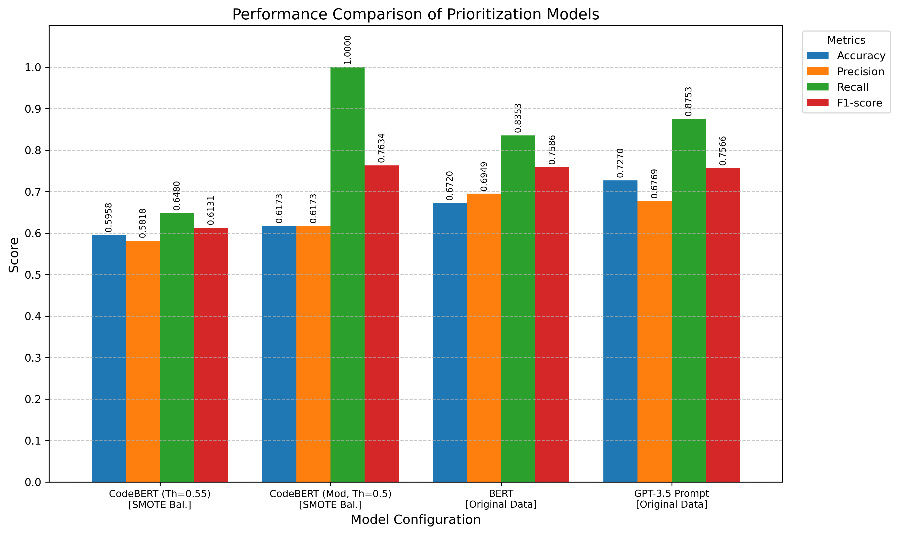

# Automated GitHub Issue Prioritization using Transformer Models

[](https://opensource.org/licenses/MIT) Code and resources for the research paper: "Prioritizing Bug Issue Reports in GitHub: A Comparative Study of Transformer Models" by Sameer Khan and Abbas Heydarnoori, Bowling Green State University.

## Overview

Manual prioritization of bug reports in large software repositories like GitHub is time-consuming, inconsistent, and can delay critical fixes. This project explores and compares the effectiveness of different transformer-based machine learning models for automating the prioritization of GitHub bug issues (classifying them as high/low priority).

We leverage the GIRT-Data dataset, focusing on Java repositories, and utilize Issue Report Template (IRT) text combined with engineered repository metadata features.

## Key Features & Contributions

* **Comparative Analysis:** Evaluates fine-tuned CodeBERT, fine-tuned standard BERT, and few-shot prompt-engineered GPT-3.5 (Airoboros).
* **Methodologies:** Demonstrates both fine-tuning and prompt engineering approaches for bug report classification.
* **Feature Engineering:** Incorporates repository activity (stars, commits, age, etc.) and IRT characteristics (length, structure) alongside textual data.
* **Performance Analysis:** Compares models using Accuracy, Precision, Recall, and F1-score, highlighting trade-offs and the impact of techniques like SMOTE and threshold tuning.

## Models Compared

1.  **CodeBERT (`microsoft/codebert-base`):** Fine-tuned, specialized for code + text. Includes experiments with SMOTE balancing, class weights, and layer freezing.
2.  **BERT (`bert-base-uncased`):** Fine-tuned, general-purpose language model baseline. Evaluated on original data distribution.
3.  **GPT-3.5 (`airoboros-gpt-3.5-turbo-100k-7b`):** Large language model evaluated using few-shot prompt engineering, incorporating text and key features. Evaluated on original data distribution.

## Methodology Outline

The overall approach involved:

1.  **Data Preparation:** Filtering the GIRT-Data dataset for Java repositories with IRTs, cleaning data, and deriving a binary priority label based on issue activity (median split).
2.  **Feature Engineering:** Extracting features from repository metadata and IRT structure (See Table 1 below).
3.  **Model Training/Prompting:**
    * Fine-tuning CodeBERT (with/without SMOTE, class weights, freezing).
    * Fine-tuning standard BERT (without SMOTE).
    * Few-shot prompting GPT-3.5 (Airoboros) with text and selected features.
4.  **Evaluation:** Calculating performance metrics on respective validation sets (SMOTE-balanced for CodeBERT, original for BERT/GPT-3.5).

*(See Figure 1 in the paper for a visual overview)*

### Table 1: Summary of Engineered Features

| Category   | Feature / Description                |
| :--------- | :----------------------------------- |
| Repository | Stargazer Count                      |
|            | Commit Frequency                     |
|            | Recent Activity (Pushed < 6 mo.)     |
|            | Contributor Count                    |
|            | Issue Activity (Open+Closed)         |
|            | Repository Age (Days)                |
| IRT        | Has IRT (Boolean)                    |
|            | IRT Length (Chars)                   |
|            | Headline Count (Markdown)            |

## Key Results Summary

*(See Table 2 and Figure 2 in the paper for full details)*

### Table 2: Performance Comparison of Prioritization Models

| Model                       | Accuracy          | Precision         | Recall            | F1-score          | Eval Data  |
| :-------------------------- | :---------------- | :---------------- | :---------------- | :---------------- | :--------- |
| CodeBERT (Th=0.55)          | 0.5958            | 0.5818            | 0.6480            | 0.6131            | SMOTE Bal. |
| CodeBERT (Mod., Th=0.5)     | 0.6173            | 0.6173            | **1.0000** | **0.7634** | SMOTE Bal. |
| BERT Model                  | 0.6720            | **0.6949** | 0.8353            | 0.7586            | Original   |
| GPT-3.5 (Airoboros Prompt)  | **0.7270** | 0.6769            | 0.8753            | 0.7566            | Original   |

*Note: Evaluation data indicates whether results are on the SMOTE-balanced validation set or the original validation set.*

### Figure 2: Performance Comparison Chart




* **Highest Accuracy (Original Data):** GPT-3.5 (Prompting) - 72.7%
* **Best F1-Score (Original Data):** BERT (Fine-tuned) - 75.9%
* **Highest Recall / F1 (Balanced Data):** Modified CodeBERT - 100% / 76.3%
* **Finding:** General models (BERT, GPT-3.5) performed competitively or better than specialized CodeBERT on the original, unbalanced data distribution for this task.

## Setup & Installation

1.  **Clone the repository:**
    ```bash
    git clone [https://github.com/your-username/github-issue-prioritization-transformers.git](https://github.com/your-username/github-issue-prioritization-transformers.git) # Replace with your repo URL
    cd github-issue-prioritization-transformers
    ```
2.  **Create a virtual environment (Recommended):**
    ```bash
    python -m venv venv
    source venv/bin/activate  # On Windows use `venv\Scripts\activate`
    ```
3.  **Install dependencies:**
    *(You need to create a `requirements.txt` file listing all necessary libraries)*
    ```bash
    pip install -r requirements.txt
    ```
    *Key libraries likely include: `pandas`, `torch`, `transformers`, `scikit-learn`, `imblearn`, `matplotlib`, `numpy`, `tiktoken` (for GPT), etc. Ensure specific versions if needed.*
4.  **Download Data:** Provide instructions here on how users can obtain the GIRT-Data CSV files and where they should place them (e.g., in the `data/` directory). *Do not commit the large dataset directly.*
5.  **Download Models (if not training from scratch):** If providing pre-trained checkpoints, explain how to download them and place them in the `models/` directory.

## Usage

1.  **CodeBERT Experiments:** Open and run the `main.ipynb` notebook in a Jupyter environment. This notebook covers data loading, preprocessing (including SMOTE), feature engineering, CodeBERT fine-tuning, and evaluation.
2.  **BERT Experiments:** Open and run the `BERT.ipynb` notebook. This covers similar steps but for the standard BERT model without SMOTE.
3.  **GPT-3.5 Prompting:** *(Describe how to run the GPT-3.5 evaluation. Since this was likely done via API calls or a separate script, provide instructions or the relevant script. If using an API, mention the need for API keys and how to set them, e.g., environment variables).*

## Citation

If you use this code or research, please cite the paper:

```bibtex
@inproceedings{khan2025prioritizing, % Replace with actual conference/journal details if accepted
  title={Prioritizing Bug Issue Reports in GitHub: A Comparative Study of Transformer Models},
  author={Khan, Sameer and Heydarnoori, Abbas},
  booktitle={To Be Determined}, % Replace with conference/journal name
  year={2024} % Corrected year
}
(Update the BibTeX entry once the paper is published or if you have a preprint link)LicenseThis project is licensed under the MIT License - see the LICENSE.md file for details. (You will need to add a LICENSE.md file with the MIT license text)ContactSameer Khan - sameerk@bgsu.eduAbbas Heydarnoori - aheydar@bgsu.eduProject Link:
